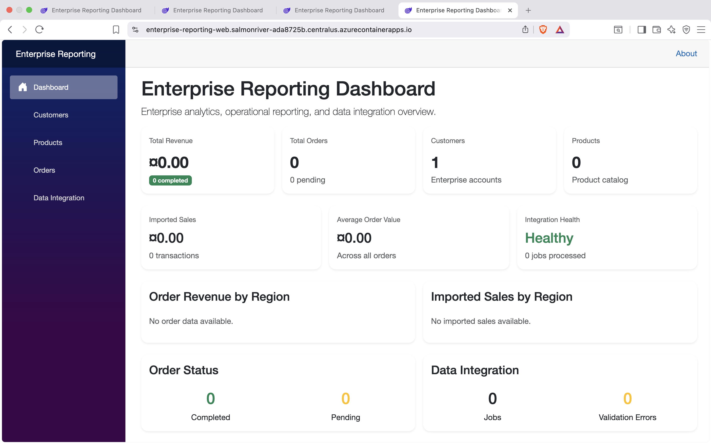

## Application Screenshots

### Enterprise Reporting Dashboard

The live dashboard provides visibility into revenue, customers, products, orders, regional sales performance, and imported sales data backed by Azure SQL.



### Data Integration & Validation

The data integration workflow demonstrates CSV ingestion, validation, duplicate detection, partial-success processing, integration-job monitoring, and validation-error tracking.


## Data Integration Pipeline

```text
CSV Upload
    |
    v
ASP.NET Core API
    |
    v
Validation & Duplicate Detection
    |
    +---- Invalid Records ---> Validation Errors
    |
    v
Entity Framework Core
    |
    v
Azure SQL Database
    |
    v
Reporting Dashboard
