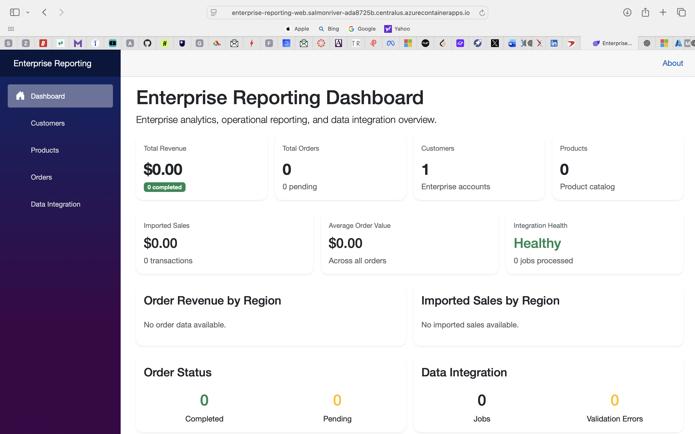

# Enterprise Reporting Platform

[](https://github.com/Lakan1509/enterprise-reporting-platform/actions/workflows/ci.yml)

A production-style enterprise reporting, analytics, and data integration platform built with .NET 10, ASP.NET Core, Blazor, Entity Framework Core, REST APIs, and Docker.

## Overview

The Enterprise Reporting Platform demonstrates a full-stack enterprise application for managing customers, products, orders, reporting dashboards, and external sales-data integration.

The system provides REST APIs, a Blazor web dashboard, database persistence, CSV ingestion and validation, integration job tracking, automated tests, Docker support, and CI/CD.

## Key Features

- Enterprise reporting dashboard
- Customer management
- Product management
- Order management
- Revenue and sales analytics
- Regional sales reporting
- CSV sales-data ingestion
- Data validation and error tracking
- Duplicate transaction detection
- Integration job monitoring
- REST API architecture
- Entity Framework Core persistence
- Blazor web interface
- Docker containerization
- Automated unit and integration tests
- GitHub Actions CI pipeline

## Architecture

```text
                    Blazor Web Application
                             |
                             v
                    ASP.NET Core REST API
                             |
          +------------------+------------------+
          |                  |                  |
          v                  v                  v
     Customer APIs       Order APIs        Product APIs
          |                  |                  |
          +------------------+------------------+
                             |
                             v
                    Entity Framework Core
                    ReportingDbContext
                             |
                             v
                    Reporting Database
                 SQLite Local Development

```

## Live Azure Deployment

The Enterprise Reporting Platform is deployed on Microsoft Azure using a production-style cloud architecture.

### Live Applications

**Web Dashboard**  
https://enterprise-reporting-web.salmonriver-ada8725b.centralus.azurecontainerapps.io

**REST API**  
https://enterprise-reporting-api.salmonriver-ada8725b.centralus.azurecontainerapps.io

### Cloud Architecture

```text
Internet
   |
   v
Azure Container Apps
   |
   +------------------------+
   |                        |
   v                        v
Blazor Web             ASP.NET Core API
                            |
                            v
                     Azure SQL Database
```

### Azure Services

- Azure Container Apps
- Azure Container Registry
- Azure SQL Database
- Azure Managed Identity
- Azure Log Analytics
- Azure Resource Groups
- Entity Framework Core SQL Server migrations

### Deployment

The API and Blazor frontend are containerized with Docker and published to Azure Container Registry. Azure Container Apps pulls the images using a user-assigned managed identity with the `AcrPull` role.

The application supports SQLite for local development and Azure SQL for cloud deployment.

### CI/CD

GitHub Actions validates every push to `main` through dependency restore, Release build, automated unit and integration tests, and NuGet vulnerability scanning.


## Application Screenshots

### Enterprise Reporting Dashboard

The live dashboard provides visibility into revenue, customers, products, orders, regional sales performance, and imported sales data backed by Azure SQL.


### Data Integration & Validation

The data integration workflow demonstrates CSV ingestion, validation, duplicate detection, partial-success processing, integration-job monitoring, and validation-error tracking.



## Data Integration Pipeline

```text
CSV Upload
    |
    v
ASP.NET Core API
    |
    v
Validation & Duplicate Detection
    |
    +---- Invalid Records ---> Validation Errors
    |
    v
Entity Framework Core
    |
    v
Azure SQL Database
    |
    v
Reporting Dashboard
